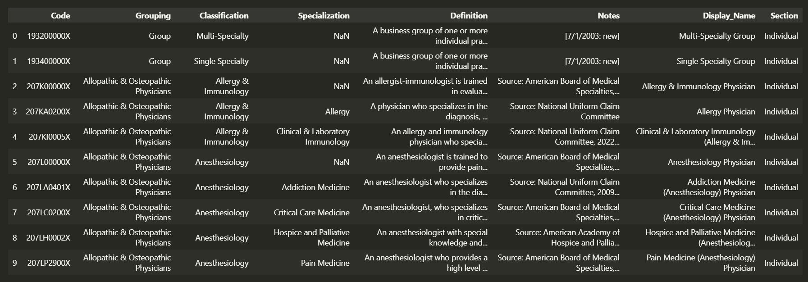
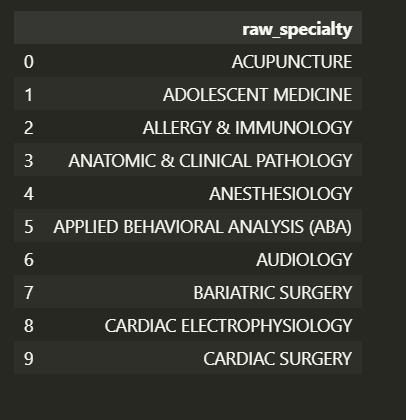
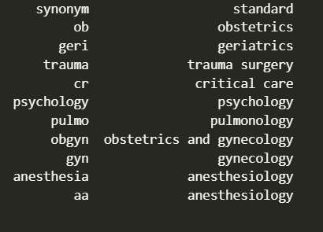
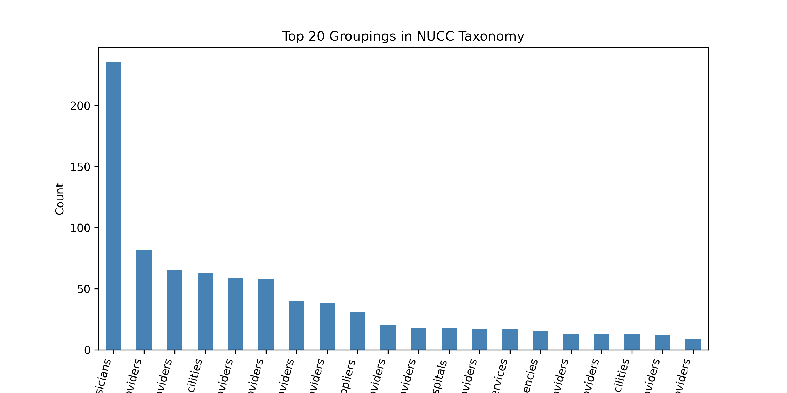
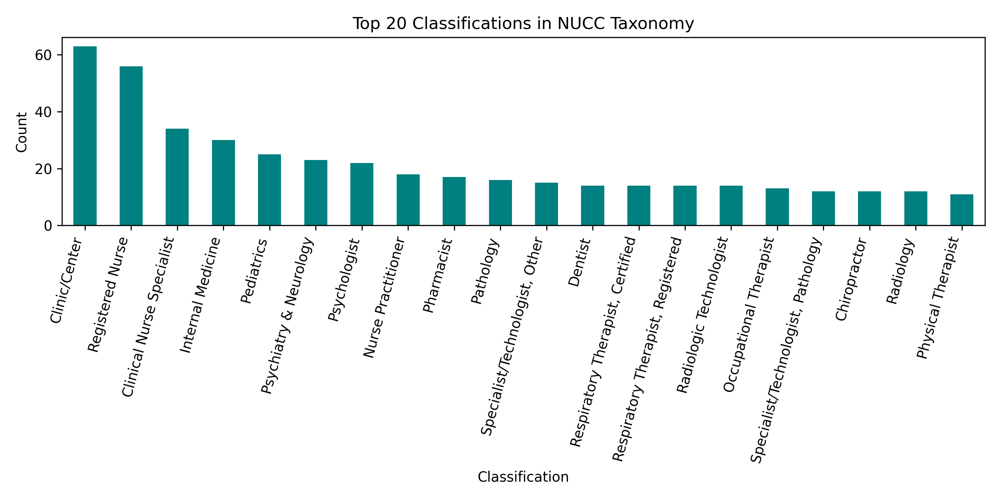

# HiLabs-Hackathon
An intelligent system that takes unstandardized specialties and maps them to official NUCC taxonomy codes.
Mapping noisy provider specialties to official NUCC taxonomy codes
1) Problem Introduction

    Health plans store millions of provider records where the specialty is often entered as free text:
    ```
    "Cardio", "ENT Surgeon", "Pediatrics - General", "Addiction Med", ...
    ```
    
    This lack of standardization creates downstream issues (claim routing errors, mismatched directories, and network adequacy gaps). The NUCC Taxonomy provides the federal standard: each specialty/sub-specialty has a unique taxonomy code (e.g., 207L00000X).
    
    Goal: Build a system that reads unstandardized specialties and maps them to official NUCC taxonomy code(s) while handling:
    
    * Abbreviations and synonyms (e.g., OBGYN → Obstetrics & Gynecology)
    
    * Misspellings/typos and partial words
    
    * Multi-specialties and noisy phrases
    
    Junk inputs (return JUNK if confidence is too low)
   
---
2) Datasets Provided

    * NUCC Taxonomy Master: dataset/nucc_taxonomy_master.csv
   
       Columns typically include:
        
        * code — the NUCC taxonomy code (primary output)
        
        * grouping — broad professional domain
        
        * classification — main specialty (e.g., Internal Medicine)
        
        * specialization — sub-specialty (e.g., Cardiovascular Disease)
        
        * display_name — a readable label
        
        * definition — description / notes
        
        * status — active/deprecated
      
      NUCC sample (head):
    
    
    * Sample Input: dataset/input_specialties.csv
      
      Columns:
        
        * raw_specialty — free-text specialty string(s)
      
      Input sample (head):
   

---
3) Synonym Dictionary

    To improve robustness against abbreviations, shorthand, and partial words, the system uses a custom synonym dictionary (dataset/synonyms.csv).
    This file helps map common medical short forms and variants to their standardized forms before embedding or fuzzy comparison.
    
    Each entry consists of two columns:
    
    * synonym → the raw or shorthand form seen in input data
    
    * standard → its canonical expansion used for matching
    
    Only semantic expansions are handled here — spelling corrections and near matches are addressed later via fuzzy matching and vector similarity.
   synonymns.csv sample (head):


---
4) EDA: Understanding the NUCC Space

Before building the matcher, we visualize label distributions to understand class imbalance and vocabulary:

Grouping distribution:


Classification distribution:


---
5) How to Run Locally

Prereqs: Python 3.10+ recommended. No GPU required.

0. Download this directory, install a virtual environment inside this directory.

1. Create & activate a virtual environment
```
python -m venv venv
venv\Scripts\activate
```
---
2. Install dependencies
In terminal, run :
```
pip install -r requirements.txt
```

3. Ensure repo structure:
```
.
├── dataset/
│   ├── nucc_taxonomy_master.csv
│   ├── input_specialties.csv
│   └── synonyms.csv              # optional
├── stopwords/
│   └── english                   # your stopword list (no NLTK download)
├── output/                       # will be created if absent
├── script.py                     # the end-to-end pipeline
└── README.md
```
5. Run
```
python simple_w2v.py
```
Result : output/output_specialties_multi.csv
or
```
python hier_w2v.py
```
Result: output/output_specialties_hier_w2v.csv


---
# Provider Specialty Standardization – Word2Vec Ensemble

* This repository implements a two separate Word2Vec-based methods for mapping raw provider specialty text entries (e.g., "Cardio", "OB/GYN", "Accupunturist") to standardized NUCC Taxonomy codes.

* Project Structure
```
.
├── dataset/
│   ├── nucc_taxonomy_master.csv      # Reference taxonomy
│   └── input_specialties.csv         # Raw specialties to map
├── synonyms.csv                      # Domain-specific synonym list
├── stopwords/english                 # Local stopword list
├── simple_w2v.py                     # Baseline syntactic Word2Vec model
├── hier_w2v.py                       # Hierarchical semantic Word2Vec model
├── ensem_w2v.py                      # Union ensemble combining both
└── output/                           # Optional output folder
```
Script 1 — Simple Word2Vec + Synonym + Fuzzy Hybrid Mapper
* This script performs semantic matching between raw medical specialties (from a user-provided dataset) and the official NUCC Taxonomy Master List using a combination of:
* Word2Vec embeddings for semantic understanding
* Synonym expansion to handle abbreviations
* Word-level fuzzy matching to tolerate spelling variations
* Cosine similarity filtering to ensure contextual relevance
* Overview
* Output
    * /output/output_specialties_multi.csv
* This CSV contains:
    * raw_specialty	nucc_codes	confidence	explanation
* Model Overview
    * simple_w2v.py – Syntactic Word2Vec Mapper
    * A lightweight Word2Vec model focusing on token-level and string-level similarity.
    * Key Details
        * Trains a 100-dimensional skip-gram model using cleaned NUCC text.
        * Performs fuzzy string matching (rapidfuzz) to handle spelling errors ("0b/gyn" → "ob/gyn").
        * Expands domain abbreviations using synonyms.csv.
        * Uses mean embedding per specialty and cosine similarity for mapping.
        * Strengths
            * Excels in syntactic robustness — catches spelling and abbreviation variants.
            * Suitable when input text is noisy or incomplete.

* Configuration Parameters
Parameter	Description	Default
FUZZ_THRESHOLD	Minimum fuzzy word match ratio between raw and taxonomy words	80
SIM_THRESHOLD	Minimum cosine similarity between sentence embeddings	0.8
FUZZY_FALLBACK	Secondary fuzzy threshold for unrecognized words	70

All thresholds can be tuned at the top of the script:

FUZZ_THRESHOLD = 80
SIM_THRESHOLD = 0.8
FUZZY_FALLBACK = 70

* Step-by-Step Methodology
    * Text Preprocessing
    * Each entry is cleaned using regex and linguistic normalization:
    * Converts to lowercase
    * Removes punctuation and non-alphanumeric characters
    * Expands symbols (&, -, /)
    * Strips stopwords and generic clinical words (clinic, doctor, unit, etc.)
    * Tokenizes and returns clean text
    ```
    def clean_text(s):
        s = re.sub(r'[^a-z0-9&/\-\s]', ' ', s)
        s = s.replace("&", " and ").replace("-", " ").replace("/", " ")
        s = re.sub(r'\s+', ' ', s).strip()
        ...
    ```
    
  * Synonym Expansion
  * A simple CSV-based dictionary (synonyms.csv) maps abbreviations or shorthand terms to canonical full forms.

    synonym	standard
    obgyn	obstetrics gynecology
    cardio	cardiology
    ent	otolaryngology
    ped	pediatrics

* Every token is replaced with its standard equivalent before embedding.
```
syn_dict = dict(zip(syn["synonym"].str.lower(), syn["standard"].str.lower()))
tokens = [syn_dict.get(w, w) for w in clean.split()]
```
* Word2Vec Model Training
    * A skip-gram Word2Vec model (sg=1) is trained locally on NUCC’s textual fields (classification, specialization, definition, display_name).

        * This helps capture contextual meaning, e.g.,
        → “cardiology” ≈ “heart medicine”
        → “ent” ≈ “otolaryngology”
```
model = Word2Vec(
    sentences=sentences,
    vector_size=100,
    window=5,
    min_count=1,
    sg=1,
    epochs=30
)
```

* Embedding Construction
    * Each NUCC record is converted into a token list (nucc["tokens"]).
    * Sentence-level embeddings are computed as the mean of all word vectors.
    * A precomputed embedding matrix is stored for fast similarity computation.
```
def sentence_embedding(words):
    vecs = [vocab[w] for w in words if w in vocab]
    return np.mean(vecs, axis=0) if vecs else np.zeros(model.vector_size)
```

* Fuzzy + Embedding Matching
* Matching is a two-stage hybrid:
* Stage 1: Fuzzy Filtering
    * Words in each input are compared to NUCC taxonomy tokens.
    * Candidates are retained if any word pair exceeds FUZZ_THRESHOLD.
```
if fuzz.ratio(rw, nw) >= threshold:
    candidates.append(i)
```
* Stage 2: Embedding Similarity
* Cosine similarity is computed between the input’s vector and each candidate’s vector.
* Only entries exceeding SIM_THRESHOLD are accepted.
```
sims = cosine_similarity(query_vec, nucc_matrix[candidates])[0]
valid_idxs = np.where(sims >= SIM_THRESHOLD)[0]
```
---
Script 2 — Hierarchical Word2Vec + TF-IDF Weighted Fuzzy Mapper
* hier_w2v.py — Hierarchical Semantic Word2Vec Mapper
   * A deeper model incorporating semantic context and hierarchy of the NUCC taxonomy.
   * Key features:
       * Trains progressively on:
           * grouping
           * classification
           * specialization + display_name + definition
           * Uses TF-IDF weighted embeddings for sentence vectors.
           * Combines fuzzy lexical overlap with semantic similarity.
           * Produces ranked matches with similarity-based confidence scores.
        * Strengths:
        * Learns semantic proximity between related specialties (e.g., "acupuncturist" ↔ "reflexologist").
        * More context-aware than the simple model.
    * Strengths
        * Excels in syntactic robustness — catches spelling and abbreviation variants.
        * Suitable when input text is noisy or incomplete.
        * hier_w2v.py – Hierarchical Semantic Word2Vec Mapper
        * A context-aware model that leverages NUCC taxonomy hierarchy and TF-IDF weighting to learn semantically richer embeddings.
  * Key Details
      * Trains sequentially on:
          * grouping → classification → specialization + definition
          * Applies TF-IDF weighting during sentence embedding.
          * Combines fuzzy lexical overlap with cosine similarity over learned vectors.
          * Provides confidence scores per match.
    * Output
./output/output_specialties_hier_w2v.csv
* Columns: raw_specialty, nucc_codes, confidence, explanation.
hier_w2v.py – Hierarchical Semantic Word2Vec Mapper

    * A context-aware model that leverages NUCC taxonomy hierarchy and TF-IDF weighting to learn semantically richer embeddings.
    * Applies TF-IDF weighting during sentence embedding.
    * Combines fuzzy lexical overlap with cosine similarity over learned vectors.
    * Provides confidence scores per match.
    * Strengths
        * Captures semantic proximity between conceptually related specialties (e.g., "acupuncturist" ↔ "reflexologist").
        * More robust when context or domain meaning matters.
    * Configuration Parameters
```
Parameter	Description	Default
FUZZ_THRESHOLD	Minimum RapidFuzz ratio for word-level candidate filtering	80
SIM_THRESHOLD	Minimum cosine similarity between embeddings	0.8
TFIDF_MIN_WEIGHT	Floor for weight normalization (avoids division by 0)	1e-9

FUZZ_THRESHOLD = 80
SIM_THRESHOLD = 0.8
TFIDF_MIN_WEIGHT = 1e-9
```

* Step-by-Step Pipeline
    * Data Loading & Normalization
    * Loads NUCC taxonomy and input specialties
    * Normalizes column names (lowercase, stripped)
    * Loads synonyms.csv → creates {synonym → standard} dictionary
```
syn_dict = dict(zip(syn["synonym"].str.lower(), syn["standard"].str.lower()))
```
* Text Cleaning & Tokenization
    * Each text entry is converted to token lists:
    * Lowercasing • Punctuation removal
    * Symbol expansion (& → and, / → space)
    * Stopword removal
    * Synonym expansion (e.g. obgyn → obstetrics gynecology)
```
def clean_text(s):
    s = re.sub(r"[^a-z0-9&/\-\s]", " ", s.lower())
    tokens = [expand_synonyms(w) for w in s.split() if w not in STOPWORDS]
    return tokens
```
* Hierarchical Corpus Construction
    * NUCC text fields are processed at multiple hierarchical levels:
    * Grouping (e.g. “Behavioral Health & Social Service Providers”)
    * Classification (e.g. “Psychologist”)
    * Specialization + Display Name + Definition
```
nucc["combined_tokens"] = (
    nucc["classification"] + " " +
    nucc["specialization"] + " " +
    nucc["display_name"] + " " +
    nucc["definition"]
).apply(clean_text)
```
* Hierarchical Word2Vec Training
    * three-stage incremental training strategy:
    * Train base embeddings on grouping tokens
    * Expand vocabulary + train on classification tokens
    * Fine-tune on full combined_tokens
```
model = Word2Vec(sentences=sentences_grouping, vector_size=150, window=5, sg=1, epochs=20)
model.build_vocab(sentences_class, update=True);  model.train(..., epochs=15)
model.build_vocab(sentences_full, update=True);   model.train(..., epochs=15)
```

* This ensures hierarchical context:
    * Group → Class → Specialization improves semantic coherence.

* TF-IDF Weighting
    * To emphasize informative words (e.g. “neuropsychiatry”, “pediatric”), a TF-IDF Model (Gensim) is trained on the combined corpus.
    * Each word vector is scaled by its TF-IDF weight, producing a weighted mean embedding for every sentence.
```
def sentence_embedding_tfidf(words):
    bow = dictionary.doc2bow(words)
    tfidf_weights = dict(tfidf_model[bow])
    vecs = [model.wv[w] * tfidf_weights[dictionary.token2id[w]] for w in words if w in model.wv]
    return np.sum(vecs, axis=0) / (np.sum(tfidf_weights.values()) + 1e-9)
```

* This reduces the influence of frequent but uninformative terms (“general”, “clinic”, “health”).

* NUCC Embedding Precomputation
    * All NUCC taxonomy entries are pre-embedded once for efficiency:
```
nucc["embedding"] = nucc["combined_tokens"].apply(sentence_embedding_tfidf)
nucc_matrix = np.vstack(nucc["embedding"].values)
```
* Fuzzy Candidate Filtering
    * For each raw specialty:
        * Tokens are fuzzily compared (via RapidFuzz ≥ FUZZ_THRESHOLD)
        * Only NUCC entries with any overlapping similar words are shortlisted as candidates
```
if fuzz.ratio(rw, nw) >= threshold:
    candidates.append(i)
```
* Cosine Similarity Matching
    * The raw specialty’s TF-IDF weighted vector is compared against candidate embeddings using cosine similarity.
    * Matches ≥ SIM_THRESHOLD are accepted; others fall back to the highest-similarity NUCC term (labeled JUNK).
* Confidence and Explanation
    * Each returned match includes:
        * nucc_code — official taxonomy code
        * confidence — cosine similarity (0–1)
        * explanation — human-readable rationale
* Example:
    * Matched 'psychiatry neurobehavioral medicine' (sim=0.92)

---
Script 3 — Hierarchical Word2Vec + Simple Word2Vec Ensemble

(It is one of my attempts to boost prediction accuracy, but could not be completed due to time constraint.)

* ensem_w2v.py – Union Ensemble
* A meta-model that runs both models automatically, merges their results, and produces a final unified prediction CSV.
* Pipeline:
   * Imports and runs both models (simple_w2v and hier_w2v).
   * Aggregates results by raw_specialty.
   * Combines NUCC codes using set union:
   * combined_codes = codes_simple.union(codes_hier)
* Strengths
    * Captures semantic proximity between conceptually related specialties (e.g., "acupuncturist" ↔ "reflexologist").
    * More robust when context or domain meaning matters.
    * ensem_w2v.py – Union Ensemble (Recommended)
    * A meta-model that runs both models automatically, merges their results, and produces a final unified prediction CSV.
* Working Logic
    * Imports and executes both base scripts (simple_w2v and hier_w2v).
    * Aggregates and merges predictions by raw_specialty.
    * Takes the union of NUCC codes from both models:
```
combined_codes = codes_simple.union(codes_hier)
```

* Labels each prediction source as:
    * simple_only
    * hier_only
    * simple+hier
* Produces a consolidated, high-confidence result table.
* Outputs
./output/output_union_ensemble.csv (or .xlsx)

* Columns:
raw_specialty, nucc_codes, source, explanation_simple, explanation_hier
* Why It’s Better
    * Combines syntactic recall (from the simple model) with semantic precision (from the hierarchical model).
    * The union ensemble ensures no valid prediction is lost — maximizing accuracy safely.
* Rationale:
    * The simple model handles noisy / misspelled inputs better.
    * The hierarchical model captures conceptual similarity.
    * The ensemble (union) leverages both — increasing recall safely.

---
Script 4 — Consistency Evaluation and Confidence Validation

* This script (consistency_check.py) is designed to test the reliability and consistency of your ensemble pipeline (ensem_w2v.py).
* It runs the ensemble twice on a random subset of input specialties and compares the results to measure model stability and prediction agreement.
* Objective
    * In real-world healthcare NLP pipelines, semantic models (like Word2Vec + TF-IDF) can produce slightly different outputs across runs due to:
        * Random weight initialization
        * Context window differences
        * Data shuffling during training
    * The Consistency Test quantifies this variation by comparing how often the ensemble’s predictions match across independent runs.
* Methodology
    * Random Subset Selection
    * A random sample (e.g., 1 000 specialties) is drawn from the input dataset:
```
sample_df = inp.sample(n=1000, random_state=42)
```
* This ensures the evaluation is lightweight yet statistically meaningful.

* Run Ensemble Twice
    * The script imports and executes script_3.py two times, which in turn runs both sub-models (script_1.py + script_2.py) and regenerates the union ensemble
    * output:
```
import importlib
ensemble = importlib.import_module("script_3")
pred_run1 = ensemble.FINAL_RESULTS
pred_run2 = ensemble.FINAL_RESULTS
```
* Each run returns predictions in the same order as the input subset.

* Compare Predictions
* For each raw_specialty, both predictions are compared on their top-ranked NUCC codes.
```
match = pred1["nucc_codes"].split("|")[0] == pred2["nucc_codes"].split("|")[0]
```
* This comparison checks whether both runs agree on the best prediction.
* Compute Metrics
    * Three simple but powerful metrics quantify the model’s reliability:
```
Metric	Description	Formula
Consistency (%)	% of samples where both runs agree	(matches / total) × 100
Disagreement Rate	% of samples with differing predictions	100 – Consistency
Mean Confidence Gap	Avg. absolute difference between the top confidences of the two runs	`mean(
```

9) Notes, Limitations & Extensions

* Typos vs. synonyms:
    * Typos are primarily handled by fuzzy token overlap; semantic variants are handled by embeddings (plus optional synonyms).

* Multi-label vs. single-label:
    * We allow multiple NUCC codes when similarity ties exceed threshold (useful for composite inputs like “Cardio/Diab”).

* Speed:
    * The fuzzy candidate filter keeps the cosine step fast enough to process ~20k rows well under 15 minutes on a typical laptop.

* Extensions:
    * Cache or pre-persist NUCC embeddings (skip recomputation on each run)
    * Adding domain-specific synonyms (e.g., “PM&R” → “physical medicine rehabilitation”)
    * Adding a lightweight spelling-correction layer before fuzzy
    * Swapping Word2Vec for BioWordVec (pretrained biomedical word2vec) if we ship the vectors locally
